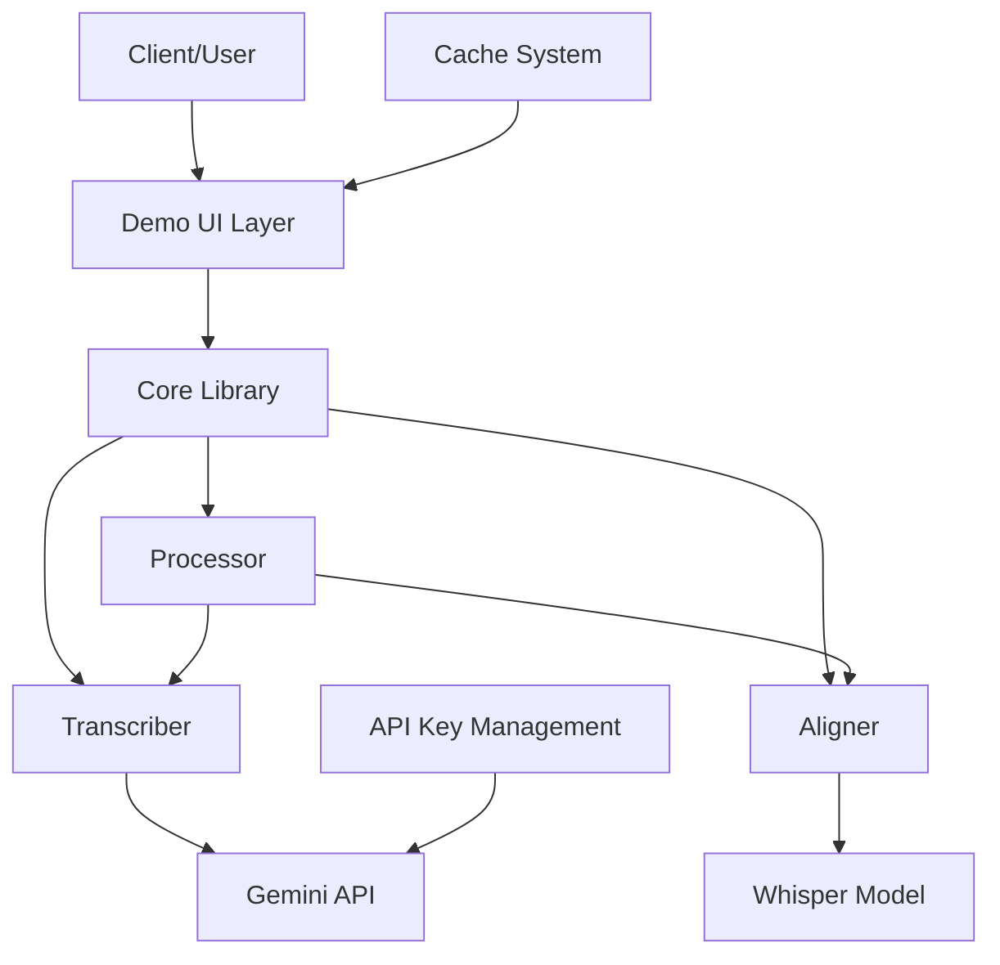
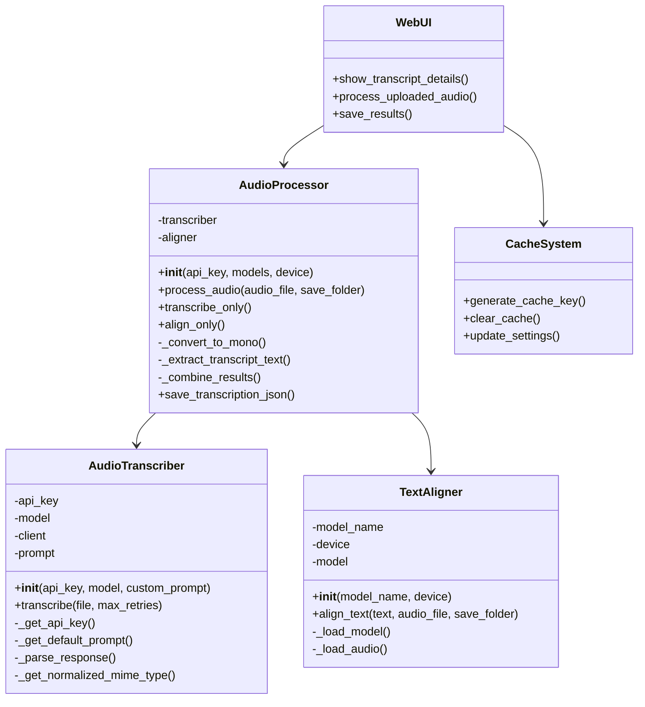
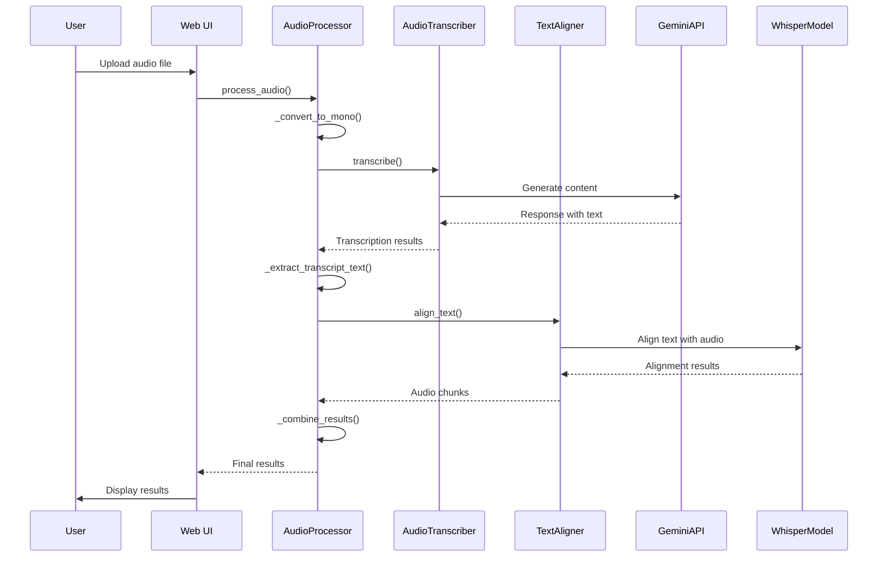
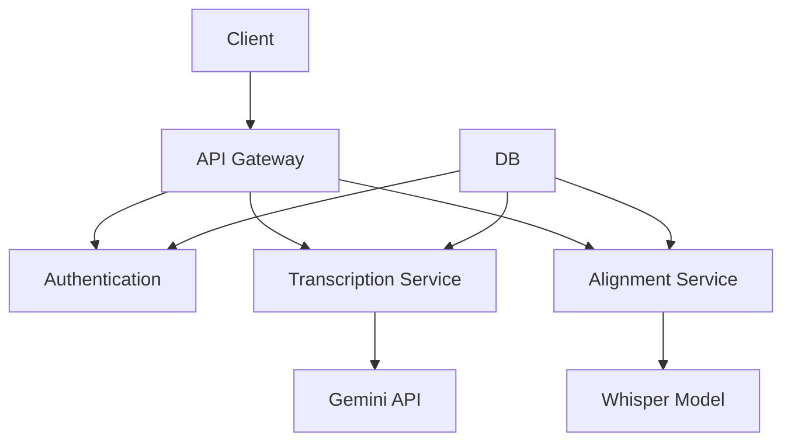
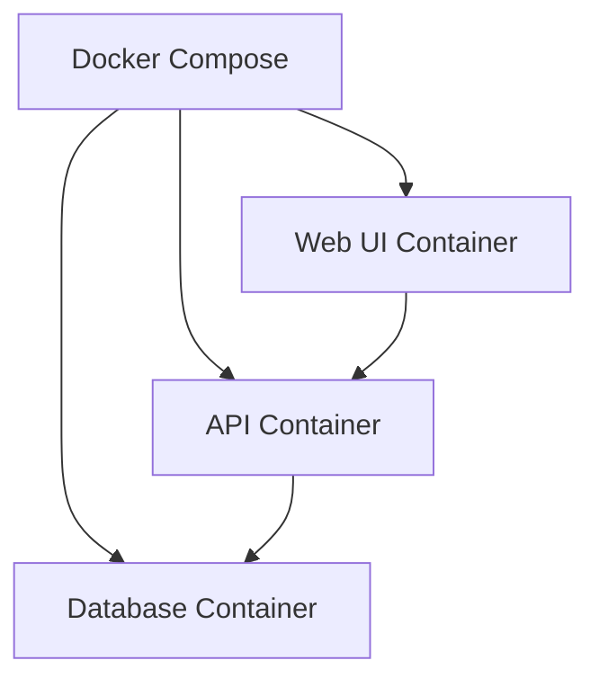

# Mẫu thiết kế hệ thống

## Kiến trúc hệ thống
Dự án Audio Transcription sử dụng kiến trúc module với các thành phần rõ ràng, cho phép mở rộng và bảo trì dễ dàng. Hệ thống hiện tại gồm hai phần chính: thư viện cốt lõi (audio_transcription) và ứng dụng demo (demo).

### Kiến trúc tổng quan


### Các thành phần cốt lõi
1. **AudioTranscriber**: Xử lý phiên âm audio bằng Google Gemini API
2. **TextAligner**: Alignment giữa text và audio sử dụng Stable Whisper
3. **AudioProcessor**: Kết hợp cả transcription và alignment thành quy trình hoàn chỉnh
4. **Demo UI**: Giao diện người dùng web dựa trên Streamlit
5. **Cache System**: Hệ thống lưu cache kết quả xử lý để tối ưu hóa hiệu suất

## Mẫu thiết kế sử dụng

### 1. Module Pattern
Hệ thống được chia thành các module riêng biệt với trách nhiệm rõ ràng:
- **Transcriber**: Phụ trách phiên âm và tương tác với Gemini API
- **Aligner**: Phụ trách text-audio alignment
- **Processor**: Kết hợp các module khác và điều phối luồng xử lý
- **Demo UI**: Phụ trách giao diện người dùng và tương tác

### 2. Facade Pattern
`AudioProcessor` hoạt động như facade, đơn giản hóa tương tác với các module con:
```python
class AudioProcessor:
    def __init__(self, api_key=None, transcription_model="gemini-2.0-flash", 
                 whisper_model="large-v3", device="cpu"):
        self.transcriber = AudioTranscriber(api_key, model=transcription_model)
        self.aligner = TextAligner(model_name=whisper_model, device=device)
    
    def process_audio(self, audio_file, save_folder=None, ...):
        # Xử lý transcription và alignment trong một quy trình hoàn chỉnh
        ...
```

### 3. Strategy Pattern
Cho phép lựa chọn thuật toán/chiến lược phù hợp khi cần:
- Chọn giữa chỉ transcription hoặc transcription + alignment
- Chọn thiết bị xử lý (CPU/GPU/MPS) cho alignment
- Sử dụng các model khác nhau cho transcription

### 4. Cache Pattern
Sử dụng caching để tối ưu hóa hiệu suất trong ứng dụng demo:
```python
# Cache AudioProcessor instance
@st.cache_resource
def get_processor(api_key, transcription_model, whisper_model, device):
    return AudioProcessor(api_key, transcription_model, whisper_model, device)
```

## Quyết định kỹ thuật chính

### 1. Phân chia nhiệm vụ Transcription và Alignment
- **Transcription**: Sử dụng Google Gemini API cho phiên âm và phân tích giọng nói
- **Alignment**: Sử dụng Stable Whisper cho việc alignment text-audio
- **Combined Approach**: Sử dụng AudioProcessor để tích hợp cả hai chức năng này

### 2. Tổ chức code theo hướng thư viện và ứng dụng
- **Thư viện cốt lõi**: audio_transcription/ chứa các module có thể tái sử dụng
- **Ứng dụng demo**: demo/ chứa giao diện người dùng và use cases cụ thể
- **Tách biệt concerns**: Xử lý audio tách biệt với giao diện người dùng

### 3. Xử lý lỗi mạnh mẽ
- Retry mechanism với exponential backoff
- API key rotation khi gặp rate limit
- Xử lý nhiều exception cases và logging chi tiết
- Cache kết quả để giảm thiểu lỗi và tăng hiệu suất

### 4. Xử lý dữ liệu
- Chuyển đổi audio từ stereo sang mono khi cần thiết
- Hỗ trợ nhiều định dạng file (WAV, MP3)
- Xử lý file data từ nhiều nguồn: path, BytesIO, bytes
- Kết quả được định dạng JSON với cấu trúc rõ ràng

## Quan hệ giữa các thành phần



## Mẫu tương tác

### Luồng xử lý transcription và alignment


### Xử lý cache
1. Người dùng cung cấp file audio
2. Hệ thống tạo cache key từ nội dung file và các tham số xử lý
3. Kiểm tra nếu kết quả đã được lưu trong cache
4. Nếu có, sử dụng kết quả cache; nếu không, xử lý file và lưu vào cache
5. Hiển thị kết quả cho người dùng

### Xử lý lỗi API
1. Hệ thống gặp lỗi khi gọi API (rate limit, model overloaded, etc.)
2. Retry mechanism kích hoạt với exponential backoff
3. Nếu là rate limit error, có thể thay đổi API key
4. Nếu là model overloaded, có thể thử với model không-lite
5. Nếu vẫn thất bại sau max_retries, thông báo lỗi

## Kế hoạch mở rộng
Kiến trúc hiện tại đã phát triển từ giai đoạn 1 sang giai đoạn 2 với giao diện người dùng web. Các kế hoạch mở rộng tiếp theo:

### API Service


### Containerization

