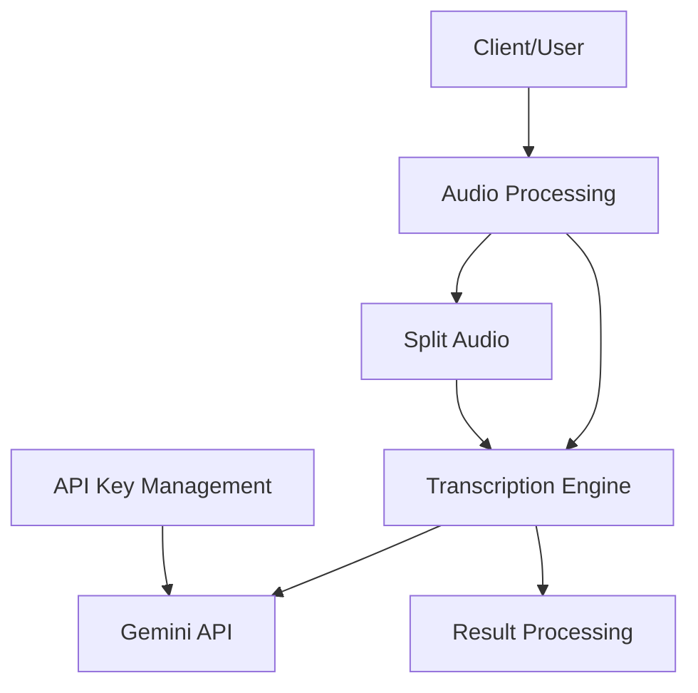
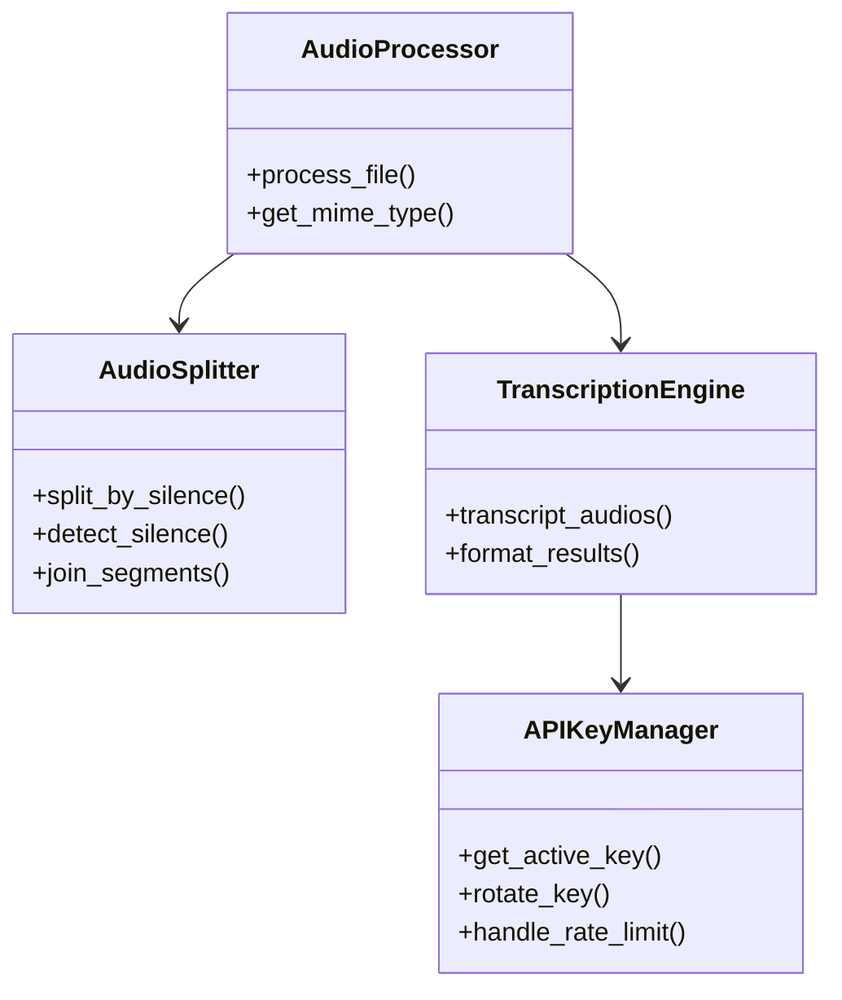

# Mẫu thiết kế hệ thống

## Kiến trúc hệ thống
Dự án Audio Transcription sử dụng kiến trúc module với các thành phần rõ ràng, cho phép mở rộng và bảo trì dễ dàng. Hiện tại, hệ thống bao gồm các thành phần chính:



### Các thành phần cốt lõi
1. **Audio Processing**: Xử lý và chuẩn bị file audio đầu vào
2. **Split Audio**: Phân tích và cắt file âm thanh dài tại các khoảng lặng
3. **Transcription Engine**: Sử dụng Gemini API để phiên âm nội dung
4. **API Key Management**: Quản lý và luân chuyển API key khi cần thiết
5. **Result Processing**: Xử lý kết quả trả về từ API

## Mẫu thiết kế sử dụng

### 1. Module Pattern
Hệ thống được chia thành các module riêng biệt, mỗi module đảm nhiệm một chức năng cụ thể:
- `audio_understanding.py`: Xử lý transcription với Gemini API
- `split_audio.py`: Cắt file audio dựa trên khoảng lặng
- `api_key.py`: Quản lý API key

### 2. Adapter Pattern
Sử dụng adapter pattern để tương tác với Gemini API, cho phép dễ dàng thay đổi hoặc mở rộng:
```python
# Ví dụ adapter cho Gemini API
def transcript_audios(files):
    # Chuẩn bị dữ liệu
    # Gọi API
    # Xử lý kết quả
    return result
```

### 3. Strategy Pattern
Cho phép lựa chọn thuật toán/chiến lược phù hợp khi cần:
- Thay đổi API key khi bị rate limit
- Lựa chọn phương pháp cắt audio phù hợp

## Quyết định kỹ thuật chính

### 1. Lựa chọn công nghệ
- **Google Gemini API**: Cung cấp khả năng phiên âm với độ chính xác cao và hiểu ngữ cảnh
- **Python**: Ngôn ngữ chính cho backend, dễ phát triển và có nhiều thư viện hỗ trợ
- **pydub**: Thư viện xử lý audio, hỗ trợ cắt và phân tích file âm thanh
- **python-magic**: Xác định MIME type cho file

### 2. Xử lý file âm thanh
- Sử dụng chiến lược cắt file dựa trên khoảng lặng, tối ưu hóa việc xử lý file dài
- Hỗ trợ nhiều format file âm thanh phổ biến

### 3. Quản lý API key
- Cơ chế luân chuyển API key khi bị rate limit
- Lưu trữ API key an toàn

### 4. Định dạng dữ liệu
- Sử dụng JSON để định dạng kết quả phiên âm, bao gồm nội dung và mô tả giọng nói

## Quan hệ giữa các thành phần



## Mẫu tương tác

### Luồng xử lý cơ bản
1. Người dùng cung cấp file audio
2. Hệ thống xác định định dạng và kích thước file
3. Nếu file quá lớn, hệ thống sẽ cắt file tại các khoảng lặng
4. Các phân đoạn được gửi tới Gemini API để phiên âm
5. Kết quả được tổng hợp và trả về cho người dùng

### Xử lý rate limit
1. Hệ thống gặp lỗi rate limit từ API
2. APIKeyManager kích hoạt và luân chuyển sang API key khác
3. Yêu cầu được thử lại với API key mới

## Kế hoạch mở rộng
Kiến trúc hiện tại được thiết kế để dễ dàng mở rộng với:
- Giao diện web (frontend)
- Hệ thống quản lý người dùng
- REST API
- Triển khai microservice
