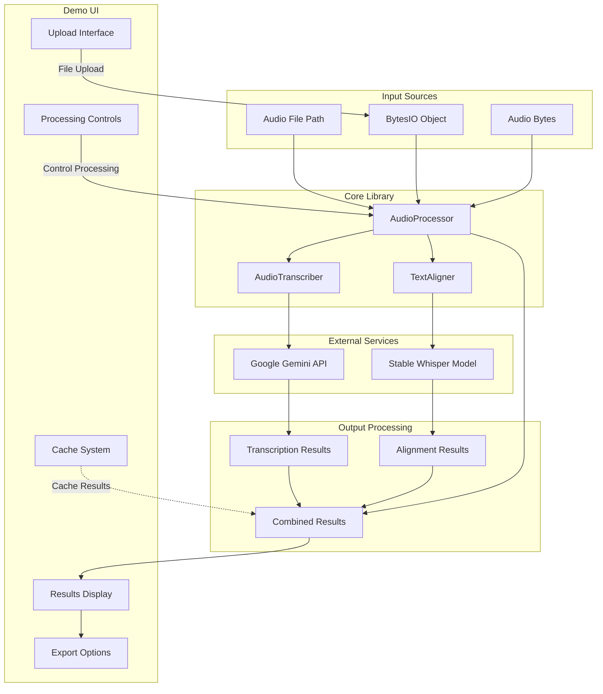
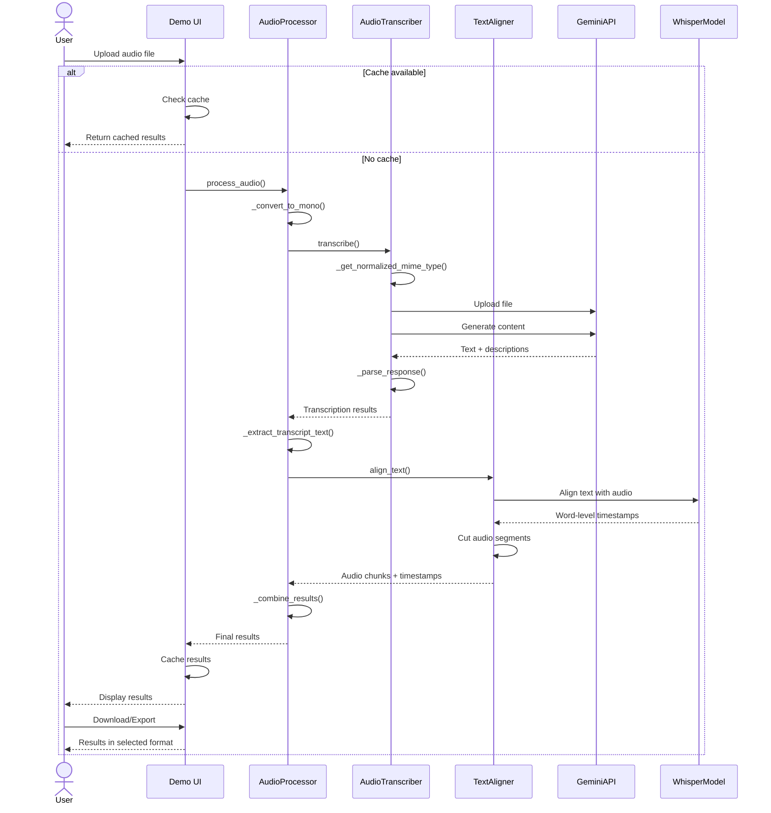
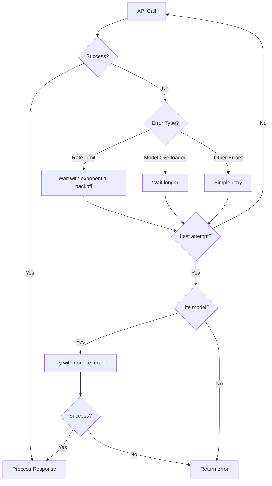
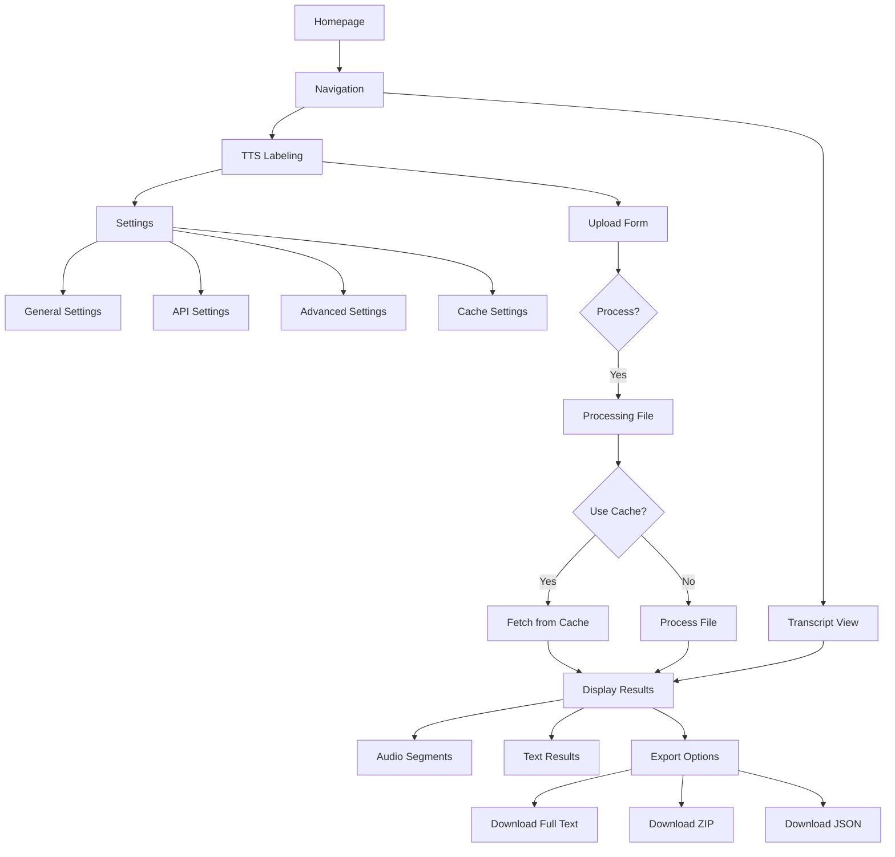
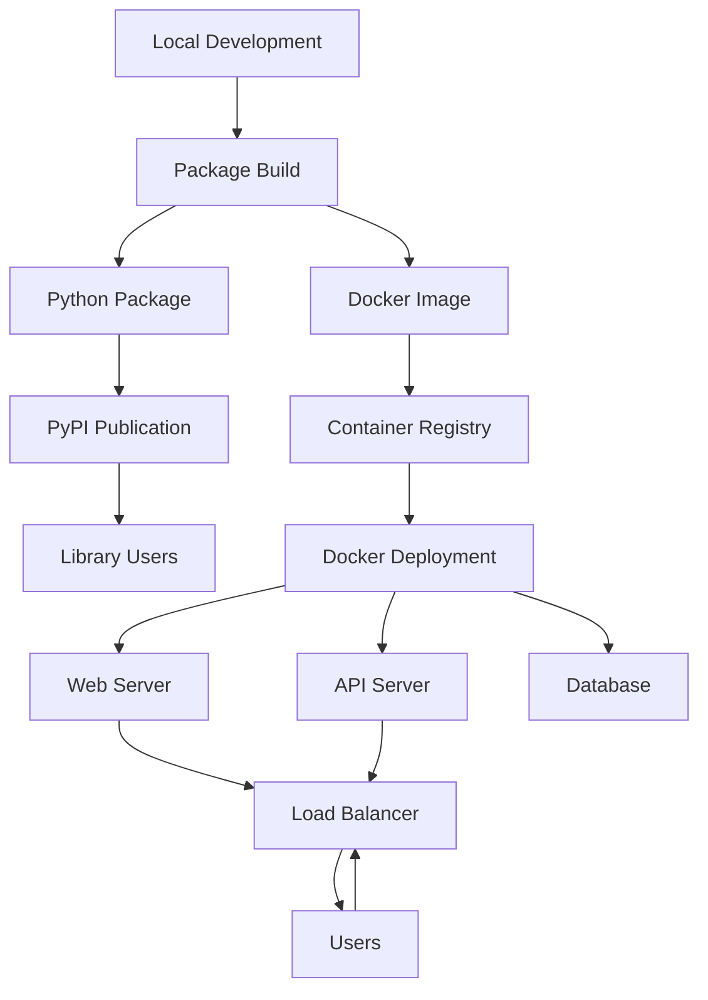

# Workflow cho dự án Audio Transcription

## Workflow tổng quan

Dưới đây là workflow tổng quan cho dự án Audio Transcription, bao gồm cả library cốt lõi và ứng dụng demo:



## Workflow xử lý audio

Chi tiết workflow cho quá trình xử lý audio từ upload đến kết quả:



## Workflow retry và error handling

Chi tiết workflow cho xử lý lỗi API và retry mechanism:



## Workflow giao diện người dùng

Chi tiết workflow cho tương tác người dùng với giao diện web:



## Workflow deployment

Kế hoạch workflow cho deployment trong tương lai:



## Workflow model caching và optimization

Chi tiết về caching và optimization trong quá trình xử lý:

```mermaid
flowchart TD
    A[Audio Input] --> B{Cached?}
    
    B -->|Yes| C[Retrieve from Cache]
    B -->|No| D[Generate Cache Key]
    
    D --> E[AudioProcessor]
    
    E --> F[Transcription + Alignment]
    F --> G[Store in Cache]
    G --> H[Return Results]
    C --> H
    
    subgraph "Resource Management" 
        I[Model Loading]
        J[File Handling]
    end
    
    I -->|@st.cache_resource| E
    J -->|BytesIO Clean-up| E
```
